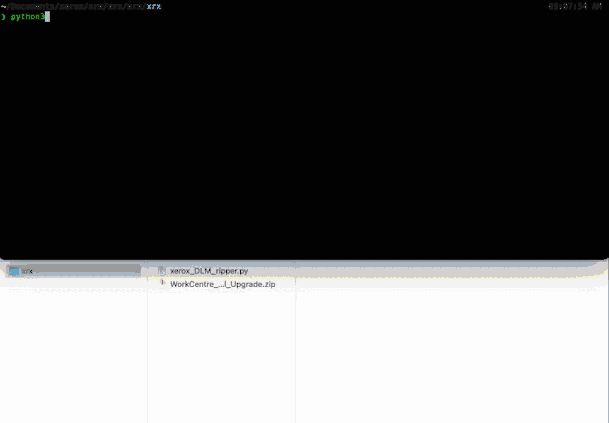

# Xerox DLM Ripper

<h4 align="center">Xerox firmware deobfuscator and extractor written in Python</h4>
<p align="center">
  
</p>

# Installation
Manual

`git clone https://github.com/adindrabkin/xerox_dlm_ripper.git`

`pip3 install -r requirements.txt`


# Usage
```
Usage: xerox_DLM_ripper.py [OPTIONS] COMMAND [ARGS]...

Options:
  --help  Show this message and exit.

Commands:
  full   Unzip and fully extract unencrypted Xerox firmware
  xzdir  Deobfuscate and unzip a directory containing obfuscated xz files
```

## Example Usage
`python3 xerox_DLM_ripper.py full WorkCentre_7830-35_Manual_Upgrade.zip`

`python3 xerox_DLM_ripper.py xzdir WorkCentre_7830-35_Manual_Upgrade/WorkCentre_7830-35-system-sw#07301007534540#ENG_MOD`